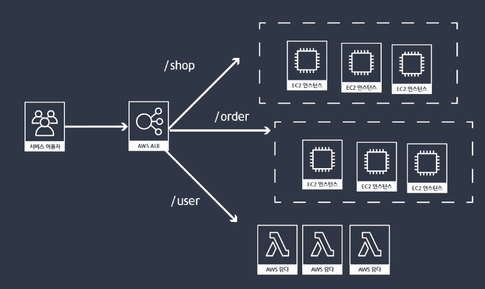
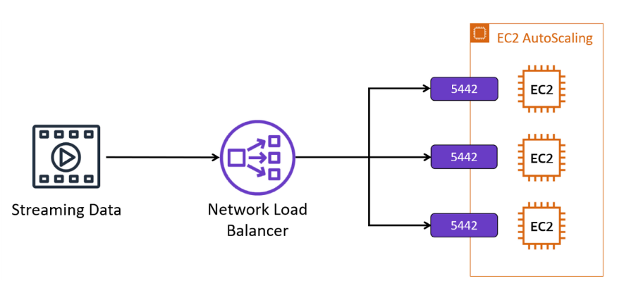
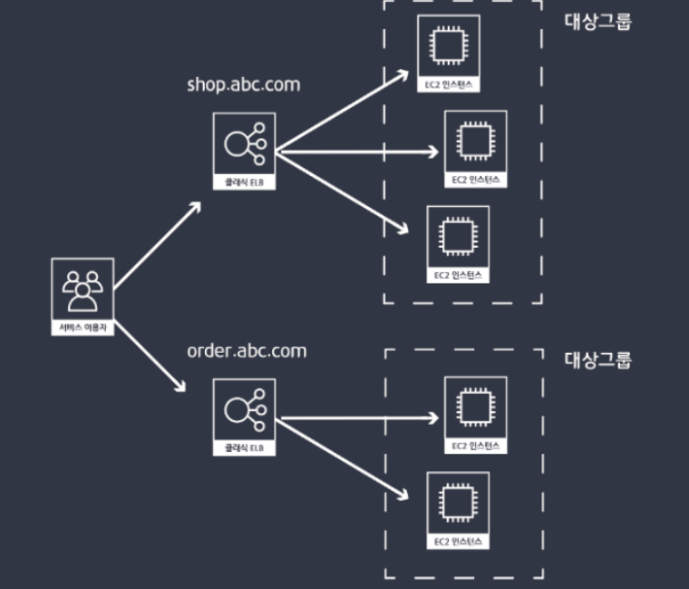
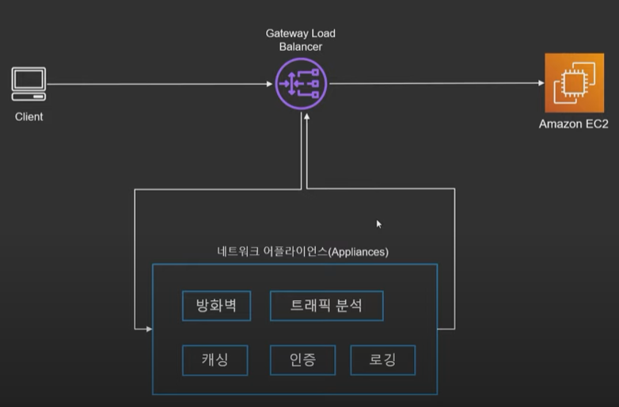
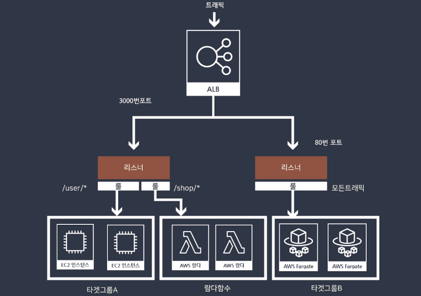
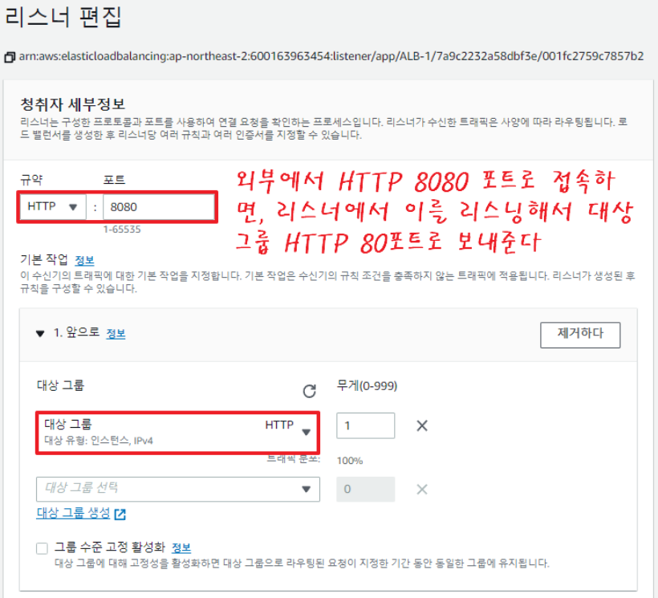
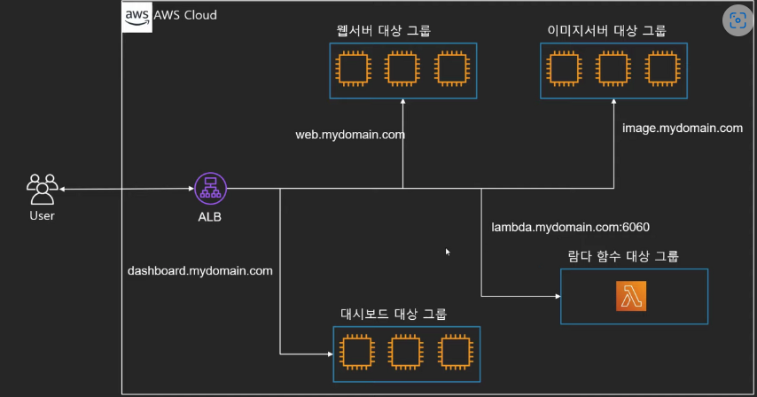
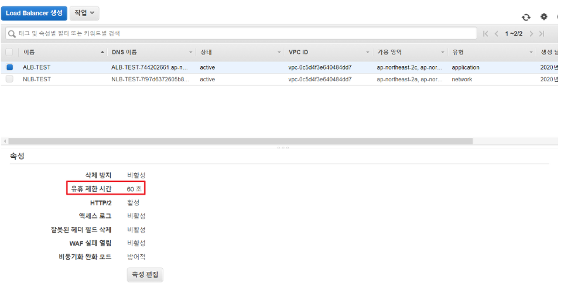

# ELB란?

애플리케이션 트래픽을 여러 대상에 자동으로 분산시켜 안정적인 AWS 서버 환경을 운용하는데에 도움을 주는 서비스

- Health Check => 직접 트래픽을 발생시켜 Instance가 살아있는지 체크
- Autoscaling과 연동가능
- 여러 가용영역에 분산 가능
- 지속적으로 IP주소가 바뀌므로 IP 고정 불가능 => **항상 도메인 기반으로 사용**
- 총 4가지 종류 ELB
    - **Application Load Balancer**
        
        
        
        - 똑똑한 녀석 **(OSI 7 Layer)**
        - 트래픽을 모니터링하여 라우팅 가능
            - ALB는 단순 부하분산뿐만 아니라 **HTTP/HTTPS의 헤더 정보를 이용해** 부하분산을 실시
            - **Path 뿐만 아니라 port에 따라서도 다른 대상 그룹으로 연결 가능**
            - Ex) image.sample.com -> 이미지 서버 , web.sample.com -> 웹 서버
        - SSL 인증서 탑재가 가능하여 EC2를 대신하여 SSL 암호화/복호화 가능
        - ALB는 IP 주소가 변동되기 때문에 Client에서 Access 할 ELB의 **DNS Name을 이용**
    - **Network Load Balancer**
        
        
        
        - 빠른 녀석
        - **4계층에 해당하는 Transport Layer를 다루는 로드밸런서**
        - TCP,UDP 기반 **빠른 트래픽 분산**
        - HTTP가 아닌 하위 Layer인 **TCP Layer에서 처리하므로 HTTP 헤더를 해석하지 못함.**
        - 고성능을 요구하는 환경에서의 부하분산에 적합한 솔루션
        - **Elastic IP 할당 가능**
        - 트래픽이 극도로 많은 경우에는 ALB보다는 NLB를 사용하는 것이 적합
        - NLB는 **SSL 적용이 인프라 단에서 불가능**하여 애플리케이션에서 따로 적용해 주어야 합니다
    - **Classic Load Balancer**
        
        
        
        - 옛날 녀석
        - 예전에 사용되던 타입으로 현재는 잘 사용되지 않음
        - 서버의 기본 주소가 바뀌면 Load balancer를 새로 생성해야하며 하나의 주소에 하나의 대상 그룹으로만 가능하다.
            - ex) 쿠팡에서 회원관리(shop) 인스턴스와 주문(order) 인스턴스가 따로 존재한다고 하자. 로그인 후 주문을 하기 위해서는 그림 처럼 각각 다른 Load Balancer를 거쳐 해당 인스턴스로 접속해야하므로 서버 개수, 비용이 증가하게 된다.
    - **Gateway Load Balancer**
        
        
        
        - 먼저 **트래픽을 체크**하는 녀석
        - 방화벽, 침입 탐지 및 방지 시스템, 심층 패킷 검사 시스템과 같은 가상 어플라이언스 배포/확장 관리를 위한 서비스
        - 트래픽이 EC2에 도달하기 전에 먼저 트래픽을 검사하거나 분석하거나 인증하거나 로깅하는 작업을 먼저 수행할 수 있게 하는 서비스

## ****ELB 리스너/Rule/대상그룹****

- ELB는 VPC에 탑재되며, 사용자의 요청을 받고 이를 VPC내의 리소스에 적절히 부하 분산한다.
- ELB는 외부의 요청을 받아들이는 **리스너(Listener)**와 요청을 분산/전달할 리소스의 집합인 **대상 그룹(Target Group)**으로 구성되며 다수의 리스너와 대상그룹을 거느릴 수 있다.
- 부하 분산 대상인 대상 그룹 내 리소스들은 헬스 체크(Health Check)를 활용해 끊임없이 상태를 확인받게 된다.
- **리스너(Listener)**는 외부의 받아들이기 때문에 **서비스 포트(Service Port)**를 보유하고 있으며 외부 요청은 **서비스 포트로 접속하는 요청만을 처리**한다.
- **대상 그룹(Target Group)** 또한 서비스 포트를 보유하고 있으며, 부하 분단 대상인 EC2는 해당 포트가 열려있어야 한다. 그리고 대상그룹의 포트는 꼭 리스너의 포트와 같을 필요는 없다.
=> 요청을 검토한 리스너가 요청이 적합한 경우 대상그룹에게 이를 전달할 때 대상 그룹의 포트로 'Port Translation'을 실시하기 때문이다

### ****리스너(Listener)****

- 리스너는 프로토콜과 포트를 기반으로 요청을 받아 검사하고 이를 적절한 타겟으로 전달하는 기능을 수행한다. 그래서 이름에 'Listen' 이 붙는 것이다.
- 모든 로드 밸런서는 최소 1개 이상의 리스너를 필요로 하며, 최대 10개까지 설정할 수 있다.
뿐만 아니라 SSL 인증서를 게시하여 SSL Offload를 실시할 수도 있다.

### 규칙(Rule)

- **리스너 룰**은 리스너와 타켓 그룹 사이의 트래픽 분배를 위한 라우팅 규칙에 해당
- **룰**은 우선순위, 액션, 조건 등의 정보를 담고 있으며, 조건이 만족되었을 때, 지정된 액션을 수행하는 방식으로 작동한다.
- **리스너 룰**에는 path, host, HTTP header, source IP, query parameter 등의 다양한 조건을 제공한다.

### 대상그룹(Target Group)

- **ALB가 라우팅 할 대상의 집합**
- 리스너가 전달한 요청을 처리하기 위한 **부하분산 대상들의 모임**
- 구성
    - 3+1 가지 종류
        - Instance
        - IP
        - Lambda
        - ALB => 특수한 케이스
    - 프로토콜(HTTP, HTTPS 등)
    - 기타 설정
        - 트래픽 분산 알고리즘, 고정 세션 등
- 대상 그룹에는 등록된 EC2의 각종 정보(인스턴스 ID, Port, AZ)가 적혀있고, 이 EC2가 전달받은 요청을 처리할 수 있는지를 체크하는 **헬스 체크(Health Check)기능**과 이 대상 그룹에 요청 처리가 가능한 EC2가 몇 개인지, 불가능한 EC2는 몇 개인지를 확인하는 요청 처리에 관련된 **'모니터링(Monitoring)'기능**이 있다.

### ****유휴 제한 시간(Connection Time out)****

- 사용자가 ELB를 거쳐 EC2에 접근하여 서비스를 접속하면 Connection이 생성된다.
- 유휴 제한 시간이란, **일정 시간동안 통신이 없을 때 커넥션을 삭제할 것인가**를 뜻한다.

### 학습자료

[쉽게 설명하는 AWS 기초 강좌 13:Elastic Load Balancer(ELB)](https://www.youtube.com/watch?v=mqtUMduyKjk)