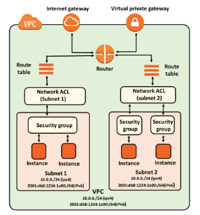

##목차
[SG(Security Group)](#sgsecurity-group)
[NACL(Network Access Control List)](#naclnetwork-access-control-list)
[SG(보안그룹)](#sg보안그룹)
[NACL(Network Access Control List)](#naclnetwork-access-control-list-1)

**AWS**는 네트워크 통신 및 트래픽에 대해 IP, Port 기준으로 허용/차단하기 위해 SG(Security Group)와 NACL(Network Access Control List) 서비스를 제공합니다. 

간단하게 둘의 차이를 먼저 보겠습니다. 

### SG(Security Group)

- 인스턴스에 대한 인바운드 및 아웃바운드 트래픽을 제어하는 가상 방화벽 역할
- 인스턴스 단위 방화벽
- **Stateful(상태유지)**

### NACL(Network Access Control List)

- 1개 이상의 서브넷 내부와 외부의 트래픽을 제어하기 위한 방화벽 역할을 하는 VPC를 위한 선택적 보안 계층
- 서브넷 단위 방화벽
- **Stateless(무상태)**

**Stateful**: 요청 정보를 저장하여 응답하는 트래픽 제어를 하지 않음.

**Stateless**: 요청 정보를 따로 저장하지 않기 때문에 응답하는 트래픽에 대한 필터링을 설정해야함. 

 

아는 IT지식이 심히 부족하여 내용이 와닿지 않아서 좀 더 찾아보았습니다. 

**SG**는 인스턴스 단위 방화벽, **NACL**은 서브넷 단위 방화벽이라 하여 구성되어 있는 아키텍쳐로 보면 이해가 쉬울 것 같아서 아키텍쳐 그림을 가져와봤습니다.

구성된 아키텍쳐를 보면서 글을 읽으니 이해 상대적으로 수월합니다..

일단 Subnet 바깥쪽에서 방화벽 역할을 하는 **NACL 즉, 외부 간 통신을 위한 것** 

그러니까 다른 Subnet쪽 혹은 외부 통신을 하려하면..? **NACL를 거치는 것** 

**SG는** Subnet 안에 있으니까 일단 서버(instance)끼리 통신을 위해 사용

또 외부 통신을 할 때에도 SG를 거쳐야 한다.

즉, 외부 통신을 할 때는 **서버 → SG → NACL** 

내부 통신을 할 때는 **서버 → SG** 

이렇게 사용하게 된다. 

각각 SG와 NACL에 대해서 추가적인 특징에 대해서 설명을 해보자면,

### SG(보안그룹)

- 기본적으로 모든 포트는 비활성화
- 선택적으로 트래픽이 지나갈 수 있는 Port와 Source를 설정 가능
- Deny는 불가능
    - **특정 IP를 차단하고 싶을 때는 NACL로 적용 가능**
- Stateful
    - Inbound로 들어온 트래픽은 추가적인 Outbound 설정 없이 나갈 수 있음
        
        
        |  | Request |  |
        | --- | --- | --- |
        | Source | 127.124.241.121 | 56630 |
        | Destination | 13.123.105.122 | 80 |
        - 56630은 임시포트
            - 임시포트는 클라이언트쪽의 OS에서 남는 포트를 아무거나 고른 것
            - 다음 요청에는 포트가 바뀔 수 있습니다.
        - 80번 포트는 정해진 포트로 같은 요청을 보낼 경우 같은 포트로 표시가 됩니다.
    - SG(보안그룹)은 Stateful하기 때문에 들어온 트래픽이 어떤 트래픽인지 기억하기에 Outbound에 대해서 따로 Allow 되어있지 않아도 그대로 내보낼 수 있는 능력이 있습니다.
        
        
        |  | Response |  |
        | --- | --- | --- |
        | Source | 13.123.105.122 | 80 |
        | Destination | 127.124.241.121 | 56630 |
- 보안 그룹의 제한사항
    - 리전 당 2,500개를 사용가능
        - 추가를 원하면 증가 요청이 가능하다.
    - 인바운드 규칙 60개, 아웃바운드 규칙 60개 (IPv4,iPv6 구분)
        - IPv4,iPv6 구분이라는 것은 인바운드, 아웃바운드 별 **ipv4 60개, ipv6 60개**
        - 추가를 원하면 증가 요청이 가능하다.

### NACL(Network Access Control List)

- 포트 및 아이피를 직접 Deny 가능
    - 외부 공격을 받는 상황 등 특정 아이피를 블록하고 싶을 때 사용
- Stateless
    - 서버 입장에서 어떤 트래픽이 들어왔는지 기억을 하지 못하기 때문에 Outbound가 Allow가 되어 있어야한다.
    - 그래서 Stateless는 들어온 트래픽 나가는 트래픽을 구분해서 포트를 열어야한다.
    - 요청을 보내는 클라이언트는 포트를 임시포트(클라이언트쪽의 OS에서 남는 포트를 아무거나 고른 것)로써 임시포트 범위에 해당하는 포트를 전체 열어야한다.
        - Linux: 32768~ 61000
        - Windows 1025-5000(XP) ,49152~65535(vista이상부터)
- VPC 생성 시 혹은 AWS 계정 생성 시 주어지는 VPC에 기본 하나 제공
- 하나의 서브넷은 하나의 NACL만 연동 가능
    - 단, 하나의 NACL은 여러 서브넷 연동 가능

추가적으로, 

“상태를 저장하면 왜 그냥 아웃바운드 포트 오픈 없이 나갈 수 있는 거지?” 라는 의문이 있었는데 

[**좋은 블로그**](https://brunch.co.kr/@ka3211/5)에서 그 해답을 얻었습니다. 

참조: https://www.youtube.com/watch?v=0hXYfi55_Ww