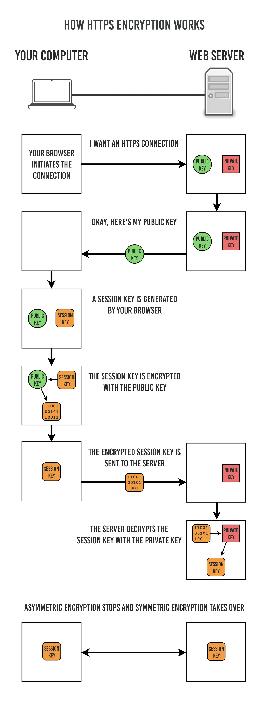

## 목차
- [HTTP](#http)
- [HTTPS](#https)
    - [HTTPS 동작 과정](#https-동작-과정)

# HTTP, HTTPS

# HTTP

- **HTTP란?**
    - 서버/클라이언트 모델을 따라 **데이터를 주고 받기 위한 프로토콜**
    - 80번 포트 사용
- **HTTP 구조**
    
    - HTTP는 애플리케이션 레벨의 프로토콜로 TCP/IP 위에서 작동
    - HTTP는 상태를 가지고 있지 않는 Stateless 프로토콜이며 Method, Path, Version, Headers, Body 등으로 구성.
    - 암호화가 되지 않는 평문 데이터를 전송하는 프로토콜이기 때문에, HTTP로 비밀번호나 주민등록번호를 주고 받으면 제 3자가 정보를 조회 가능

# HTTPS

- HTTPS란?
    - HTTPS는 HTTP에 데이터 **암호화가 추가된 프로토콜**
    - 443포트 사용

HTTPS는 대칭키 암호화 방식과 비대칭키 암호화 방식 모두 사용

- **대칭키**
    - 클라이언트와 서버가 동일한 키를 사용해 암호화/복호화를 진행
    - 키가 노출되면 위험하지만 연산 속도가 빠름
- **비대칭키**
    - 1개의 쌍으로 구성된 공개키와 개인키를 암호화/복호화 하는데 사용
        - 공개키 = 모두에게 공개가능한 키
        - 개인키 = 나만 가지고 알고 있어야 하는 키
    - 키가 노출되어도 비교적 안전하지만 연산 속도가 느림
    - 공개키 암호화
        - 공개키로 암호화를 하게 되면 개인 키로만 복호화 가능
        - 개인키는 본인만 가지고 있으므로, 본인만 볼 수 있음
        - **정보 자체를 암호화가 필요할 때 사용**
    - 개인키 암호화
        - 개인키로 암호화하면 공개키로 복호화 가능
        - 공개키는 모두에게 공개되어 있으므로, 본인이 인증한 정보임을 알려 신뢰성 보장
        - **정보를 생산한 사람의 신원에 대한 정보가 필요할 때 사용**

## HTTPS 동작 과정

HTTPS는 대칭키 암호화와 비대칭키 암호화를 모두 사용하여 빠른 연산 속도와 안정성을 모두 얻음.

HTTPS 연결 과정(Hand-Shaking)에서는 먼저 서버와 클라이언트 간에 세션키를 교환 

세션키는 주고 받는 데이터를 암호화하기 위해 사용되는 대칭키이며, **데이터 간의 교환에는 빠른 연산 속도가 필요하므로 세션키는 대칭키로 만듬**

세션키를 클라이언트와 서버 **교환 과정에서 비대칭키가 사용**된다.

- **HTTPS 연결 과정이 성립되는 흐름**
    
    
    
    1. 클라이언트(브라우저)가 서버로 최초 연결 시도를 함
    2. 서버는 공개키(**인증서**)를 브라우저에게 넘겨줌
    3. 브라우저는 인증서의 유효성을 검사하고 세션키를 발급함
    4. 브라우저는 세션키를 보관하며 추가로 서버의 공개키로 세션키를 암호화하여 서버로 전송함
    5. 서버는 개인키로 암호화된 세션키를 복호화하여 세션키를 얻음
    6. 클라이언트와 서버는 동일한 세션키를 공유하므로 데이터를 전달할 때 세션키로 암호화/복호화를 진행함
